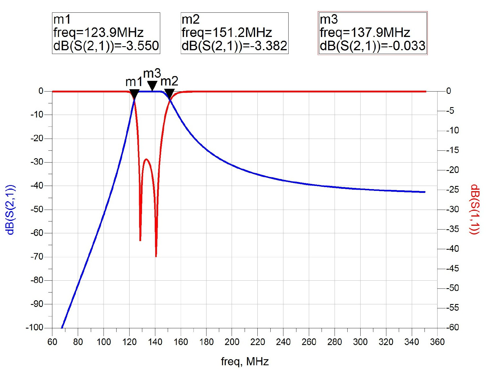
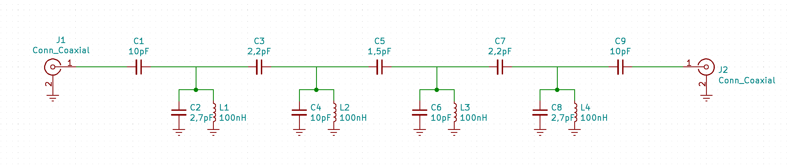
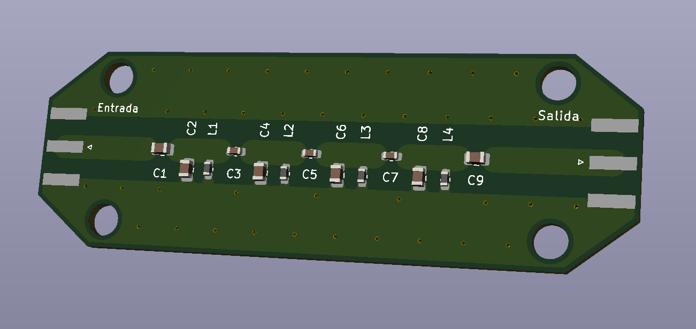

# Filtro-2m-NOAA

Filtro paso banda para banda de radioaficionados de 2m y satélites NOAA/Meteor, con alto rechazo en zona de frecuencias de radiodifusión FM.

## Especificaciones

- Tipo: Tchebyshev

- Impedancia entrada/salida: 50 Ohm

- Frecuencia de corte inferior (3dB): 125MHz

- Frecuencia de corte superior (3dB): 150MHz

- Pérdidas de inserción: 1dB máx.

- S11 en banda de paso: -15dB máx.

- Rechazo banda radiodifusión FM: 45dB (min)

- Rechazo banda radiodifusión TV: 50dB (min)

## Materiales

| Componente | Valor | Métrica |
|:----------:|:-----:|:-------:|
|     C1     |  10pF |   0805  |
|     C2     | 2,7pF |   0805  |
|     C3     | 2,2pF |   0603  |
|     C4     |  10pF |   0805  |
|     C5     | 1,5pF |   0603  |
|     C6     |  10pF |   0805  |
|     C7     | 2,2pF |   0603  |
|     C8     | 2,7pF |   0805  |
|     C9     |  10pF |   0805  |
|     L1     | 100nH |   0603  |
|     L2     | 100nH |   0603  |
|     L3     | 100nH |   0603  |
|     L4     | 100nH |   0603  |
|     L5     | 100nH |   0603  |
|  Conector  |  SMA  |    -    |

## Resultados

Parmámetros S:

Esquemático: 

Modelo 3D:

